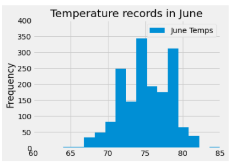

# surfs_up

## Project Overview
W.Avy would like to know about temperature trends before opening the surf and ice cream shop in Oahu, Hawaii. 
Specifically, he wants temperature data for the months of June and December  to determine if the surf and ice cream shop business is sustainable year-round. 

## Purpose: - 
To determine the summary statistic for June and December. 

## Results: - 
Summary statistics for the months of June and December are as follows: -  

                             

Based on the summary statistics, June (1700) has higher number of temperature observations compared to December. Similarly, the mean temperature was 
slightly higher in June. Further analysis on precipitation was conducted for the months of June and December to determine the amount of rain. 
The table below shows the average and maximum precipitations was higher in December than June. 

                                  

Summary: - based on the above analysis on temperature, precipitation, and visualization, the average, maximum and minimum results were 
almost similar for two months, it looks like the surf and ice cream shop business is sustainable year-round. But, further analysis or 
data are required to see the significance level. 